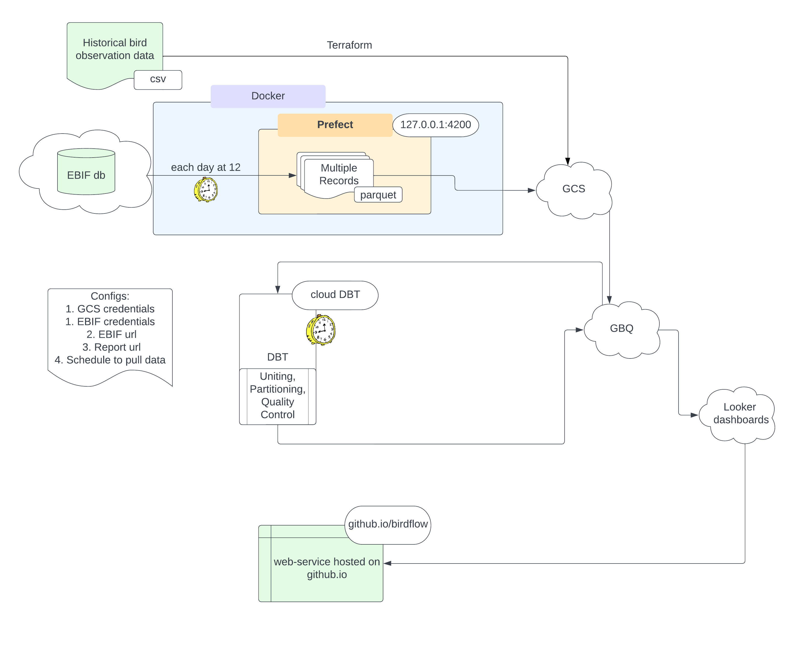

# BirdFlow
An app to view the location of birds on Cyprus

Service web page: 
https://dariader.github.io/bird_cy_flow/
### Disclaimer 
All of the data used in the project belongs to GBIF.org and ebird.org

1) ``` GBIF.org (13 November 2022) GBIF Occurrence Download https://doi.org/10.15468/dl.ghe39q ```

2) ``` Fink, D., T. Auer, A. Johnston, M. Strimas-Mackey, S. Ligocki, O. Robinson, W. Hochachka, L. Jaromczyk, A. Rodewald, C. Wood, I. Davies, A. Spencer. 2022. eBird Status and Trends, Data Version: 2021; Released: 2022. Cornell Lab of Ornithology, Ithaca, New York. https://doi.org/10.2173/ebirdst.2021 ```

### Contact
Through `issues` on GitHub

### Dependencies:

1. Prefect
2. DBT(Cloud)
3. Python 3.10
4. GCS, GBQ access
5. Ebird db access

Run:
`pip install -r /src/requirements.txt`

### Schema of the project

Steps: 
1. Upload historical data to GCS and BQ
2. Set up a regular cron job to schedule downloads of data from ebird database
3. Set up a DBT cloud, schedule a job to periodically regenerate dataset to update the present data 
4. Using Looker and core_bird_data_model schema create a dashboard
5. Share dashboard as a widget and integrate into github.io. Code of webpage is index.html.  

## HOW TO RUN: 
### Get Data
#### Archive data
Must be retrieved from GBIF. They consolidate data for a large period (each several months). 
For that you need: 
1) register in GBIF -- get password and username
2) ask for permission to load data (cyprus bird observation data for desired period of time)
3) download and put this data in `./data/` folder. See code for that in `/src/get_historical_data.sh`
4) edit config.yaml file section: 

```commandline
### folders
folders:
  historical_data_folder: "../data/<NAME>.csv"
```
#### Realtime data
This data is retrieved from ebird servers, which are updated ~each hour. 
To be able to source data from ebird, you need to 
1) register here: https://ebird.org/home
2) get api key, put it in the config file (config.yaml)

### Set up Google cloud
1. create workspace and project, put names into config.yaml AND variables.tf
```Config yaml
gcp_project:
  title: birdflow << change this
  bucket_name: dtc_data_lake_us_birdflow << change this
```
```Terraform
locals {
  data_lake_bucket = "dtc_data_lake_us" # GCS bucket name
  project = "birdflow" # project name << change this
  historical_bird_file = "./data/0163061-220831081235567.csv" # location of historical data << change this
  historical_data_name = "historical_bird_data" # DO NOT CHANGE
  gcs_bucket = "${local.data_lake_bucket}_${local.project}"  # DO NOT CHANGE
}
```

2. create service account in IAM tab, create and export json keys
3. create environment variable GOOGLE_APPLICATION_CREDENTIALS and write the path to the json with GCP credentials
4. write location of json keys to config.yaml

### Terraform 
1. terraform will create GCS lake and upload historical observations file

run: 
` terraform plan `
` terraform apply `

### Cron job
Set as working directory the directory of the project.

run:

`/usr/bin/crontab /src/prefect_scheduler/schedule`

This will launch cron job with the parameters in the `schedule` file

or add the contents of `/src/prefect_scheduler/schedule`
in the prompt of `crontab -e` command
### Cron job monitoring
run
`prefect orion start`

### Set up DBT schedule:
1) login to DBT cloud, create project, clone this repo
2) In Environment tab:
create environment, set BQ dataset name
3) in Create Jobs tab:
choose environment, set as trigger -- schedule, run each day at 12 (cron: 0 12 * * *). 

### Set up Looker:
1) Login to looker
2) Connect to database
3) Create plots
4) Select 'Sharing' --> embed report --> embed URL
5) Insert URL into index.html `iframe` `src` attribute

### Set up Github io
1) Login to github
2) Go to Settings --> Pages
3) Set up branch for deploy
4) You will see resulting url of the web-page with embedded report


## Known bugs to be fixed
1) Docker image is not yet working
2) Prefect flows should be scheduled solely by Prefect, and not cron. Or I will change Prefect to AirFlow. 
3) Lost data from december'22 - april'23